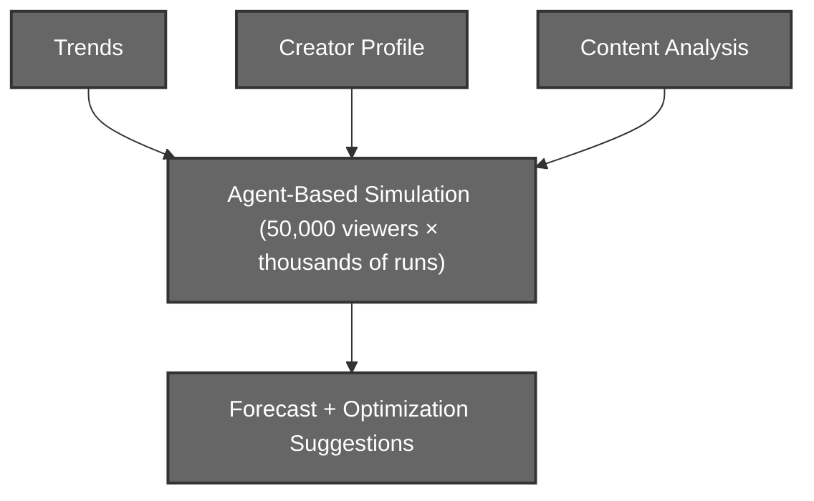

# Content Diffusion Simulator

A social-media **digital twin** that forecasts a post's reach, engagement, and viral potential **before it goes live**, by combining real-time trend intelligence, creator profiling, multi-modal content understanding, and an agent-based simulation of how content spreads across an algorithm-driven feed.

Instead of scoring a post once, it **replays the post thousands of times** across a population of 50,000 synthetic viewers, then reports the range of outcomes and how to improve them.



---

## The Five Layers

| Layer | Role | Documentation |
| ----- | ---- | ------------- |
| **1. Trend Engine** | Collects trends from Reddit / YouTube / Google Trends into a persistent semantic graph, and exports a trend snapshot. | [Layer 1, Trend Engine](<documentation/Layer 1 (Trend Engine).md>) |
| **2. User Engine** | Profiles the creator (YouTube + Instagram) into 5 creator-intelligence scores. | [Layer 2, User Engine](<documentation/Layer 2 (User Engine).md>) |
| **3. Context Engine** | Multi-modal understanding (video / image / text) → 8 engagement dimensions, composites, topics, entities. | [Layer 3, Context Engine](<documentation/Layer 3 (Context Engine).md>) |
| **4. Social Ecosystem Simulator** | Agent-based spread over 50k personas → reach distribution, viral probability, confidence. | [Layer 4, Simulator](<documentation/Layer 4 (Simulator).md>) |
| **5. Analyse Engine** | Turns the forecast into ranked, re-simulation-tested optimization suggestions. | [Layer 5, Analyse Engine](<documentation/Layer 5 (Analyse Engine).md>) |

Layers 2 to 5 are served by the FastAPI app; the Trend Engine runs as its own module and writes the trend snapshot consumed by the simulator.

---

## Prerequisites

- **Python 3.12**
- **[Ollama](https://ollama.com)** running locally (for the image vision model)
- **A C++17 compiler** to build the simulator, MSYS2 `ucrt64` g++ on Windows
- **[ngrok](https://ngrok.com)**, for Instagram's HTTPS OAuth callback
- **API keys**: Gemini, Reddit, YouTube (Google OAuth), Instagram (Meta OAuth)
- *(Optional)* an NVIDIA GPU for faster transcription

---

## Setup

### 1. Install Python dependencies

```bash
python -m venv env
env\Scripts\activate            # Windows  (source env/bin/activate on macOS/Linux)

pip install -r requirements.txt
python -m spacy download en_core_web_sm

# Optional - only on a machine with an NVIDIA GPU (faster-whisper on CUDA):
pip install -r requirements-gpu.txt
```

### 2. Pull the vision model

```bash
ollama pull qwen3-vl:4b
```

Make sure the Ollama server is running before analysing images or video.

### 3. Build the simulator (Layer 4)

```bash
cd Simulator
build.bat                       # Windows cmd
# or, from a bash shell:
# g++ -std=c++17 -O2 -Wall -Wextra -Iinclude src/*.cpp -static -o simulator.exe
```

### 4. Configure environment

```bash
copy .env.example .env          # then fill in your keys
```

Required keys are listed in [.env.example](.env.example), Reddit, YouTube, Instagram, and Gemini.

---

## Running

```bash
python run.py
```

---

## Instagram / Meta: live HTTPS callback via ngrok

Meta requires an **HTTPS** OAuth redirect URI, so a plain `http://localhost` callback will not work for Instagram. Expose the local server through an HTTPS tunnel:

```bash
ngrok http 8000
```

ngrok prints a forwarding URL such as `https://abc123.ngrok-free.app`. Then:

1. Set the redirect URI in `.env` to the tunnel's **`/user/auth/instagram/callback`** path:
   ```
   INSTAGRAM_REDIRECT_URI="https://abc123.ngrok-free.app/user/auth/instagram/callback"
   ```
2. Add the **same** URL to your Meta app's OAuth "Valid redirect URIs".
3. Restart `python run.py`.

Notes:
- **YouTube** uses Google OAuth, which permits `http://localhost`, ngrok is only needed for Instagram.
- Start OAuth by opening the `/user/auth/...` URLs as a **real browser navigation**, not from the Swagger docs (the docs can't follow the external redirect).
- Instagram works only for **public Business / Creator** accounts.

---

## API Surface

| Layer | Endpoints |
| ----- | --------- |
| 2. User Engine | `GET /user/auth/{youtube,instagram}` · `GET /user/auth/{youtube,instagram}/callback` · `GET /user/creator/analyze` |
| 3. Context Engine | `POST /context/analyze/{text,image,video}` · `GET /context/content` |
| 4. Simulator | `POST /simulate` |
| 5. Analyse Engine | `POST /analyse` |

Typical flow: connect a creator → analyze content → `/analyse` with the returned `content_id` + `user_id` for the forecast and suggestions.

---

## Datasets

**Personas (Layer 4).** The simulator's 50,000-viewer audience is derived from **[NVIDIA Nemotron-Personas-USA](https://huggingface.co/datasets/nvidia/Nemotron-Personas-USA)**, a large, census-grounded population of synthetic personas. They are mapped by **Gemini Flash** into the simulator's persona schema and calibrated for content-viewing behavior (see the [Layer 4 documentation](<documentation/Layer 4 (Simulator).md>) for the calibration details). The compiled pool lives at `Simulator/Personas/personas.jsonl` (large, not tracked in git).

**Tag taxonomy (Layer 1).** The Trend Engine's hierarchical tag system is built from the **IAB Tech Lab** advertising taxonomies: **[Content Taxonomy 3.1](https://github.com/InteractiveAdvertisingBureau/Taxonomies/blob/develop/Content%20Taxonomies/Content%20Taxonomy%203.1.tsv)** and **[Ad Product Taxonomy 2.0](https://github.com/InteractiveAdvertisingBureau/Taxonomies/blob/develop/Ad%20Product%20Taxonomies/Ad%20Product%20Taxonomy%202.0.tsv)**. Their tiered category paths become the standardized tag nodes and parent/child structure.

---

## Notes

- **Frontend**: a React UI ("Reech") in `Frontend/`, wired to the backend via `VITE_API_BASE` (see [Frontend/.env.example](Frontend/.env.example)). Run it with `npm run dev` from `Frontend/`.
- **GPU is optional**, without it, transcription runs on CPU.
- **Ollama must be running** for image and video analysis.
- The **Trend Engine** is run on its own to refresh `data/trends/trend_snapshot.json`, which the simulator reads.
