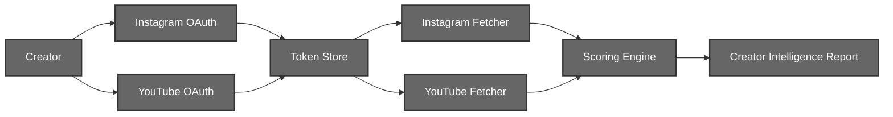
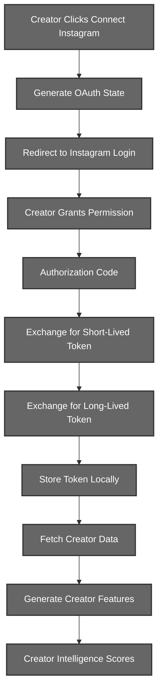

# User Engine (Layer 2)

## Creator Intelligence System

# 1. Introduction

The User Engine is responsible for collecting creator-specific information from supported social media platforms and transforming raw platform statistics into standardized creator intelligence features.

The current system supports:
- Instagram
- YouTube

Each platform follows an independent authentication and data collection pipeline while producing a unified representation that is later consumed by the Creator Intelligence Scoring Engine.

---

# 2. System Architecture



The User Engine is divided into three major stages:

- Authentication
- Data Collection
- Creator Intelligence Scoring

Each stage is platform-independent and communicates through standardized data structures.

---

# 3. Instagram Creator Intelligence Pipeline

## 3.1 Motivation

Instagram restricts access to creator information through OAuth authentication and the Instagram Graph API.

The pipeline is designed to solve several problems:

- Secure authentication without storing user passwords
- Long-term authenticated access through long-lived access tokens
- Automatic token refresh
- Normalization of multiple API responses into a single creator representation
- Graceful degradation when optional analytics are unavailable


## 3.2 Complete Workflow




## 3.3 Authentication Phase

### Step 1 : OAuth State Generation

When the creator initiates authentication, the backend generates a cryptographically secure random OAuth state.

The state is associated with:

```text
User ID
Platform
Creation Time
```

and is temporarily stored in the local database.

Its purpose is to:

- prevent Cross Site Request Forgery (CSRF)
- correlate the callback with the correct creator
- ensure every authentication request is uniquely identifiable
- prevent replay attacks through one-time state consumption

### Step 2 : Instagram Authorization

Using the generated state, an Instagram OAuth URL is constructed containing:

```text
Client ID
Redirect URI
Requested Scopes
Response Type
OAuth State
```

The creator is redirected to Instagram's authorization page where they authenticate using their own Instagram credentials and explicitly grant permission to the application.

The application never receives or stores the creator's password.

### Step 3 : Authorization Code Generation

After successful authentication, Instagram redirects the creator back to the registered callback endpoint.

The callback contains:

```text
Authorization Code
OAuth State
```

The backend validates the OAuth state before continuing.

If the state is invalid or expired, the authentication request is immediately rejected.


## 3.4 Token Exchange

Instagram does not directly provide a long-lived access token.

Instead, authentication occurs in two stages.


### Stage 1 : Short-Lived Access Token

The authorization code is exchanged for a short-lived access token.

The response contains:

```text
Access Token
Instagram User ID
```

This token is temporary and is intended only as an intermediate credential.

### Stage 2 : Long-Lived Access Token

Immediately after obtaining the short-lived token, the backend exchanges it through the Instagram Graph API.

```text
Authorization Code
        ↓
Short-Lived Access Token
        ↓
Long-Lived Access Token
```

The resulting token typically remains valid for approximately sixty days.

The system stores:

```text
Access Token
Instagram User ID
Expiration Timestamp
```
instead of storing only the remaining lifetime.
Using an absolute expiration timestamp simplifies future validation and refresh operations.

## 3.5 Token Persistence

The generated long-lived token is stored locally in the Creator Token Store.

Each record is uniquely identified by:

```text
User ID
Platform
```

If the creator reconnects their Instagram account, the existing token is automatically updated rather than creating duplicate records.

This guarantees that only one active credential exists for each platform per creator.


## 3.6 Automatic Token Refresh

Before every creator analysis request, the stored token is validated.

The remaining lifetime is calculated as:

```text
Expiration Time - Current Time
```

If the token is approaching expiration, the backend automatically refreshes it through the Instagram Graph API.
This refresh process is completely transparent to the creator and eliminates the need for repeated logins.

## 3.7 Creator Data Collection

Once a valid token is available, the Instagram Fetcher retrieves creator information from multiple Graph API endpoints.


### Profile Information

The first endpoint retrieves creator account metadata.

Collected fields include:

```text
Username
Account Type
Followers Count
Following Count
Media Count
```

The pipeline only supports Business and Creator accounts.

Personal accounts are rejected because they do not expose the required analytics.

### Recent Content Collection

The second endpoint retrieves the creator's most recent posts.

For each post the following information is collected:

```text
Post ID
Caption
Media Type
Timestamp
Like Count
Comment Count
Permalink
```

Only the most recent twenty posts are retrieved.

This provides sufficient information for engagement and activity analysis while minimizing unnecessary API requests.

---

### Account Reach Analytics

The third endpoint attempts to retrieve creator reach statistics over the previous twenty-eight days.

Collected metric:

```text
Monthly Reach
```

Since this endpoint requires additional Instagram permissions, the fetcher follows a best-effort strategy.

If:
- permissions are unavailable,
- the endpoint changes,
- the metric is temporarily unavailable,

the fetcher simply returns:

```text
Monthly Reach = 0
```

instead of interrupting the complete creator analysis pipeline.
This design ensures that optional analytics never prevent score generation.

## 3.8 Data Normalization

The multiple Graph API responses are transformed into a single standardized creator representation.

```python
{
    "platform": "instagram",
    "username": "...",
    "followers": ...,
    "following": ...,
    "media_count": ...,
    "monthly_reach": ...,
    "recent_posts": [...]
}
```

The Scoring Engine never interacts directly with Instagram APIs.
Instead, it always receives this normalized representation regardless of how many API requests were required to construct it.

# 4. YouTube Creator Intelligence Pipeline

> *Documentation to be added.*

---

# 5. Creator Intelligence Scoring

> *Documentation to be added.*