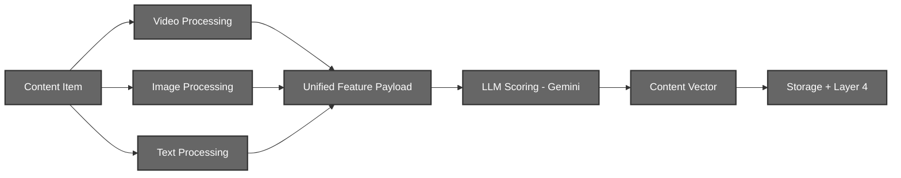
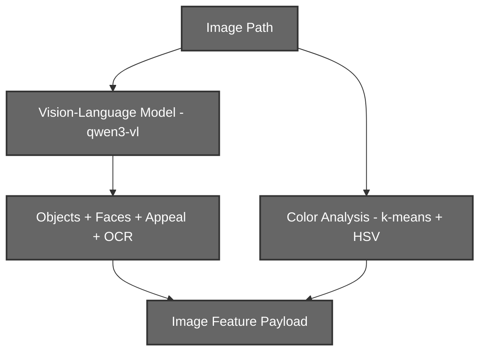
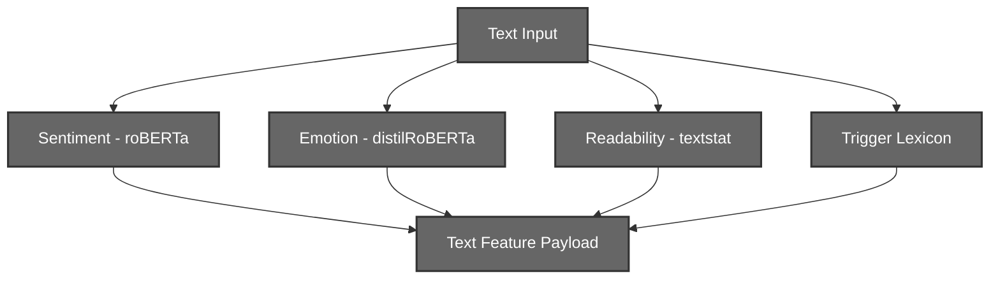
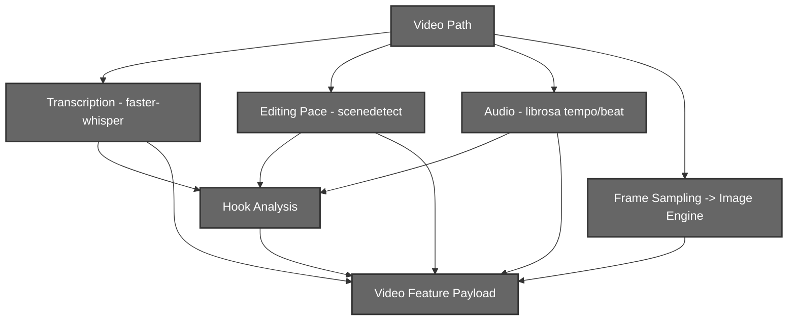
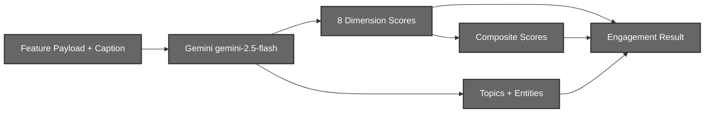
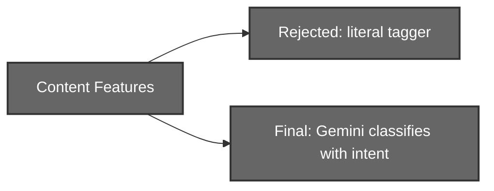
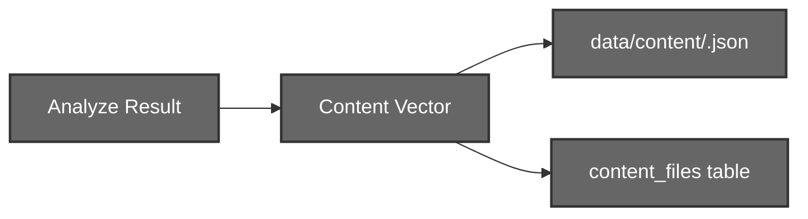

# Context Engine (Layer 3)

## Multi-Modal Content Understanding System

# 1. Introduction

The Context Engine reads a piece of content, a video, an image, or text, and produces a structured understanding of it: what it contains, how it will make a viewer feel, and what it is about.

The engine works in two stages:

```text
Stage 1 - Perception:  extract raw features from the raw media
Stage 2 - Judgment:    score those features into engagement dimensions
```

Perception is **modality-specific** (a video is processed very differently from a caption), but every modality produces a **unified feature payload** that the single scoring layer consumes. This keeps one scoring rubric across all content types.

The final output is a compact **content vector**, eight engagement dimensions, two composite scores, a topic classification, named entities, and creator tags, which becomes the content input to the Layer 4 simulator.

The current system supports:

- Video content
- Image content
- Text content

---

# 2. Motivation

## Why Understand the Content At All?

The simulator needs to know *what it is showing to viewers*. A raw video file means nothing to an agent-based model. It needs numbers: how funny, how novel, how controversial, how shareable.

```text
Raw media
    ↓
??? (a viewer reacts to something, but to what?)
```

The Context Engine fills that gap by converting raw media into the exact vector the simulator's engagement model expects.

## Why Two Stages?

Extracting features and judging them are different problems.

- **Feature extraction** is mechanical and modality-bound, transcribe audio, detect faces, read the caption.
- **Judgment** is subjective and modality-agnostic, "is this funny?" is the same question whether the joke is in a video or a caption.

Separating them means one consistent scoring rubric is applied to every content type, and new modalities can be added without touching the scorer.

## Why an LLM Judge?

Traditional classifiers need a labelled dataset per dimension and still miss intent.

Example:

```text
A cooking video that is actually a JOKE
```

A literal tagger labels this `food_cooking`. A language model, given the extracted features, understands the intent and labels it `comedy`. The engine uses a calibrated LLM judge so that scoring and classification capture **intent**, not just surface content.

---

# 3. System Architecture



The engine is orchestrated by `ContentUnderstandingEngine`, which **lazily loads** each modality engine and the scorer on first use. One content item flows through exactly one modality path, then through the shared scorer, then into storage.

The four stages:

- Perception (Video / Image / Text processing)
- Engagement Scoring
- Topic & Entity Classification
- Content Vector Export

---

# 4. Technology Stack

| Stage             | Technology                                             | Purpose                              |
| ----------------- | ------------------------------------------------------ | ------------------------------------ |
| Video Transcription | faster-whisper (`WhisperModel`, GPU/CUDA)            | Speech → transcript + subtitles      |
| Editing Pace      | PySceneDetect                                          | Scene-cut detection → pacing         |
| Audio Analysis    | librosa                                                | Tempo, beat, music presence          |
| Image Understanding | Ollama VLM (`qwen3-vl:4b`)                           | Objects, faces, appeal, OCR text     |
| Color Analysis    | k-means + HSV harmony                                  | Palette + color harmony              |
| Text Sentiment    | `cardiffnlp/twitter-roberta-base-sentiment-latest`     | Sentiment                            |
| Text Emotion      | `j-hartmann/emotion-english-distilroberta-base`        | Emotion classification               |
| Readability       | textstat (Flesch)                                      | Readability metrics                  |
| Scoring & Classification | Gemini `gemini-2.5-flash` (structured output)   | 8 dimensions + topics + entities     |

---

# 5. Image Processing Pipeline

## 5.1 Motivation

Image analysis extracts the object, face, color, and text signals from a single image so the scorer can judge visual content.

## 5.2 Workflow



## 5.3 Vision-Language Model

A local Ollama VLM (`qwen3-vl:4b`) inspects the image and returns:

```text
Objects detected
Faces detected + dominant facial emotion
Visual appeal score (0-10) + reasoning
Text content (OCR of any on-image text)
```

Running the model locally means unlimited calls with no per-image API cost.

## 5.4 Color Analysis

Independently of the VLM, the palette is extracted with k-means clustering and scored for harmony in HSV space:

```text
Dominant palette (RGB / hex / proportion)
Harmony score + label (e.g. "monochromatic / neutral")
```

## 5.5 Feature Output

```python
{
    "objects_detected": { "<object>": count },
    "faces_detected": int,
    "facial_emotions": [str],
    "visual_appeal_score": float,
    "visual_appeal_reasoning": str,
    "color_analysis": { "palette": [...], "harmony_score": float, "harmony_label": str },
    "text_content": str
}
```

---

# 6. Text Processing Pipeline

## 6.1 Motivation

Text analysis extracts sentiment, emotion, readability, and trigger signals from a caption or a text post.

## 6.2 Workflow



## 6.3 Components

| Signal      | Method                                                    |
| ----------- | -------------------------------------------------------- |
| Sentiment   | Twitter-tuned roBERTa sentiment pipeline                  |
| Emotion     | DistilRoBERTa emotion classifier                          |
| Readability | textstat Flesch reading-ease                              |
| Triggers    | Lexicon of emotional / engagement trigger words           |

## 6.4 Feature Output

```text
Raw text
Sentiment
Emotion
Readability
Emotional triggers
```

The text models run on CPU by default; the raw caption text is preserved so the scorer can read the actual words, not just the derived metrics.

---

# 7. Video Processing Pipeline

## 7.1 Motivation

Video is the richest modality. It combines what is said, how it is cut, how it sounds, and what faces appear on screen.

## 7.2 Workflow



## 7.3 Components

| Signal        | Method                                                                 |
| ------------- | --------------------------------------------------------------------- |
| Transcript    | faster-whisper on GPU → transcript + subtitles                        |
| Editing pace  | PySceneDetect scene-cut count → cutting rhythm                        |
| Audio         | librosa tempo / beat / music presence                                 |
| Frame emotion | Up to 30 sampled frames passed through the **Image Engine** for faces |
| Hook          | Derived from the opening transcript, pace and audio                   |

Reusing the Image Engine for frame emotion means faces in a video are analysed by the exact same VLM used for still images.

## 7.4 Feature Output

```text
Transcript
Subtitles
Editing pace
Audio analysis
Frame emotions
Hook analysis
```

---

# 8. The Unified Feature Payload

Every modality engine, regardless of internal pipeline, returns the same envelope:

```python
{
    "modality": "video" | "image" | "text",
    "extracted_features": { ... modality-specific features ... }
}
```

`ContentUnderstandingEngine.analyze()` selects the modality, builds this payload, and hands it to the scorer along with any caption text:

```python
engine.analyze(video_path=...)   # or image_path=... / text=...
        ↓
{ "modality": ..., "extracted_features": ..., "engagement": ... }
```

The scorer never needs to know which pipeline produced the features; it always sees the same envelope.

---

# 9. Engagement Scoring

The scoring layer (`LLMScoringLayer`) is the judgment stage. It sends the feature payload and any caption to Gemini and receives structured, anchored scores.



## 9.1 The Eight Dimensions

Each dimension is scored 0-10 against a fixed rubric, with a one-sentence reasoning. The model is instructed to score how a **broad general audience** would react, not the model's own taste, and to score low when the signal is absent rather than guess high.

| Dimension           | 0                      | 4                         | 7                          | 10                              |
| ------------------- | ---------------------- | ------------------------- | -------------------------- | ------------------------------- |
| humor               | no attempt             | mildly amusing            | clearly funny to most      | laugh-out-loud                  |
| curiosity           | nothing intriguing     | mild "huh, interesting"   | a real open loop           | irresistible "I NEED to know"   |
| educational         | teaches nothing        | a minor takeaway          | a clear, useful lesson     | densely informative             |
| novelty             | generic, seen a lot    | familiar with a fresh angle | distinctly original      | surprising, one of a kind       |
| controversy         | universally agreeable  | mild disagreement         | clear opposing camps       | highly polarizing               |
| emotional_intensity | flat / neutral         | a noticeable feeling      | strong emotion             | intense high-arousal            |
| relatability        | niche / alienating     | a specific subgroup       | "that's so me" for many    | near-universal recognition      |
| practical_value     | nothing actionable     | a usable tip              | a how-to worth keeping     | immediately actionable          |

> Controversy is a **signal, not a virtue**, a high score is not "good"; it simply tells the simulator the content will polarize.

## 9.2 Determinism

Scoring uses temperature 0.0, so identical content receives identical scores, a property the rest of the pipeline relies on.

## 9.3 Structured Output

The response is validated against a Pydantic schema (`PrimaryScores`), so the eight dimensions, topics, and entities always arrive in a fixed, typed shape. Each dimension is a `{score, reasoning}` pair, and that reasoning is later reused by Layer 5 to ground its suggestions.

---

# 10. Composite Scores

Two composites are derived from the eight dimensions using fixed weights. These map directly to the two signals the algorithm rewards most.

## 10.1 Shareability

How likely a viewer is to send this to a friend.

```text
shareability = 0.30 × emotional_intensity
             + 0.20 × humor
             + 0.20 × novelty
             + 0.15 × relatability
             + 0.15 × controversy
```

## 10.2 Saveability

How likely a viewer is to bookmark it for later.

```text
saveability = 0.45 × practical_value
            + 0.35 × educational
            + 0.20 × novelty
```

Both weight sets sum to 1.0, so composites stay on the same 0-10 scale as the dimensions. The weights are validated at startup, a set that does not sum to 1.0 raises an error rather than silently producing out-of-range scores.

---

# 11. Topic and Entity Classification

In the **same** Gemini call that scores the dimensions, the model also classifies the content.

## 11.1 The 24-Topic Taxonomy

Topics come from a fixed, closed list (a Pydantic enum), so the classification is always one of 24 known categories, the same taxonomy the persona pool and trend snapshot use.

```text
comedy, gaming, tech, fitness, food_cooking, beauty_fashion, travel, music,
sports, education_howto, news_politics, finance_business, art_design, science,
lifestyle_vlog, parenting_family, pets_animals, automotive, diy_crafts,
motivation_selfhelp, relationships, nature_outdoors, film_tv, health_wellness
```

The model selects the 1-3 topics that best capture what the content is **about**.

## 11.2 Entities

The model also extracts named subjects, people, events, places, brands, works, using their common canonical names so they are recognizable to downstream matching:

```text
"FIFA World Cup"  (not "the world cup")
"Lionel Messi"    (not "Messi" or "him")
```

An empty list is returned when there are no specific named subjects.

## 11.3 Why LLM-Native, Not a Tagger

Classification is done by the scoring model, not a separate tagging pipeline. This was a deliberate design choice.



| Approach       | Behaviour on a cooking-themed JOKE meme    |
| -------------- | ------------------------------------------ |
| Literal tagger | `food_cooking` (surface content)           |
| Gemini judge   | `comedy` (understood intent)               |

The LLM-native approach captures genre topics that never appear literally in the text, produces no tagging noise, and needs no external knowledge-base pipeline.

---

# 12. Content Vector Export

Scoring produces a rich result; the simulator needs a compact vector. The export step distils the engagement result into exactly what Layer 4 reads.

## 12.1 The Content Vector

```python
{
    "dims": {                       # 8 dimensions, 0-10
        "humor": ..., "curiosity": ..., ... "practical_value": ...
    },
    "composites": { "shareability": ..., "saveability": ... },
    "topics":   { "<topic>": 1.0 or 0.0 },   # 24-vec binary presence
    "entities": [str],                        # named subjects
    "tags":     [str]                         # creator hashtags from the form
}
```

Topics are expanded from the model's 1-3 selections into a full 24-length binary vector, so the simulator can dot it against the trend snapshot.

## 12.2 Storage

Each analysed item is written to disk and tracked in the database.



The saved file carries the **content vector at the top level** (what the simulator reads) plus a full `analysis` block holding the complete engagement result, including every dimension's reasoning.

```python
{
    "content_id": "<uuid>",
    "username": "...",
    "created_at": "...",
    "modality": "...",
    ... content vector ...,
    "analysis": { ... full engagement result with reasoning ... }
}
```

A `content_files` table (`content_id`, `username`, `path`, `modality`, `created_at`) records every file so the simulator can find a creator's content by id rather than by parsing filenames.

## 12.3 Tags

The get-started form's hashtags are accepted by the analyze routes, normalized (list / JSON-string / comma-separated all supported, de-duplicated), and stored in the vector. They feed the simulator's tag-trend channel.

## 12.4 Why Keep the Full Analysis Block

The compact vector is enough for the simulator, but the full analysis, especially each dimension's one-sentence reasoning, is retained. Layer 5 reuses that reasoning to ground its optimization suggestions in the post's own specifics, so what would otherwise be dead weight becomes useful downstream.

---

# 13. GPU and Whisper Setup

faster-whisper runs on the GPU and needs the CUDA 12 cuBLAS / cuDNN libraries. These live in a separate GPU requirements file so a CPU-only contributor is never forced to install them.

Before importing faster-whisper, the video engine prepends the installed NVIDIA library directories to `PATH` (process-local, harmless if absent), so the correct CUDA DLLs are found. The Ollama VLM uses the GPU automatically; the transformers text models run on CPU unless a CUDA build of torch is installed.

---

# 14. API Endpoints

Analysis and storage happen in a single call, there is no separate "evaluate then store" round-trip.

```text
POST /context/analyze/text    ?username=...      body: { text, tags }
POST /context/analyze/image   ?username=...      form: file, text, tags
POST /context/analyze/video   ?username=...      form: file, text, tags
GET  /context/content         ?username=...      list a user's stored content
```

Each analyze route returns the full engagement result plus `topics`, `entities`, `tags`, `content_id`, and `saved_to`. The `content_id` is what the caller passes to the Layer 4 / Layer 5 simulation routes.

The username is a client-supplied query parameter (no auth; this is an internal layer-to-layer boundary) and is stored raw, since files are uuid-named and the database uses parameterized queries.

---

# 16. Known Gaps

- The image VLM call runs once per sampled video frame (up to 30), which can be slow for demos.
- An image with no OCR text and no caption yields little for topic classification.
- The topic vector is binary presence; a per-topic confidence weight would give a richer interest match in the simulator.
- Entity matching against the trend snapshot is fuzzy by necessity, free-form names versus resolved labels.

---


# 18. Conclusion

The Context Engine is the pipeline's perception layer. It turns raw, unstructured media into a precise numeric understanding, eight engagement dimensions, two composites, a topic classification, and named entities, through a two-stage design that keeps perception modality-specific and judgment modality-agnostic.

Its LLM-native scorer captures *intent* rather than surface content, its output is deterministic and structured, and its exported content vector is exactly what the Layer 4 simulator needs to begin showing the post to its synthetic audience. Nothing it computes is wasted: even the per-dimension reasoning finds a second life grounding Layer 5's suggestions.
