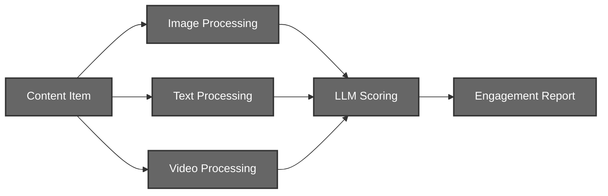
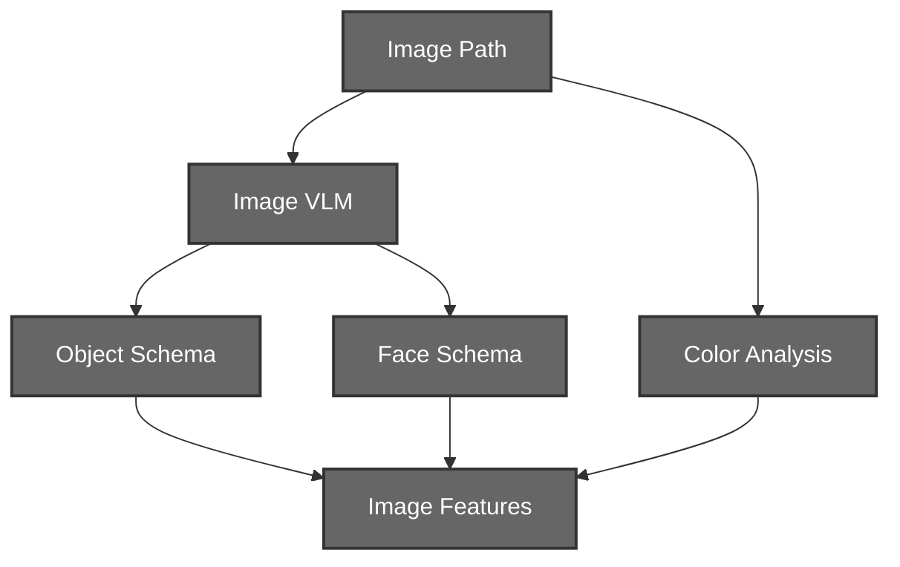
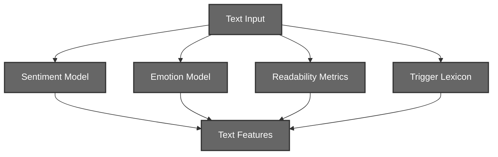
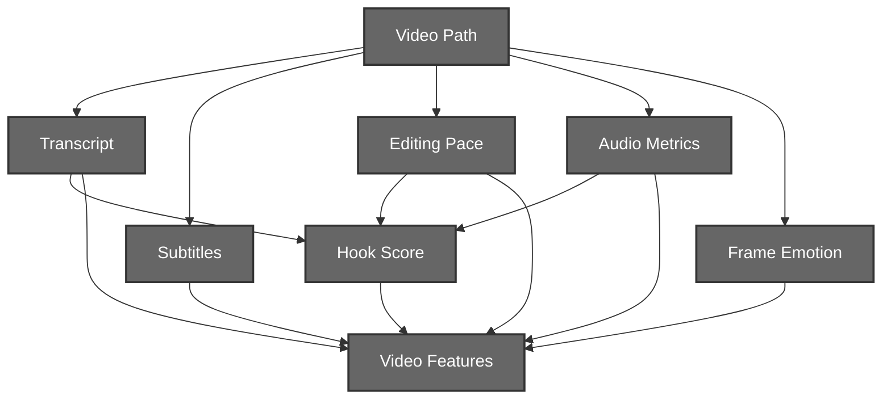

# Context Engine (Layer 3)

## Content Understanding System

# 1. Introduction

The Context Engine converts raw content into structured features and then scores those features for downstream use.

The current system supports:
- Image content
- Text content
- Video content

Each modality runs through its own processing path while producing a unified feature payload that the scoring layer can consume.

---

# 2. System Architecture



The Context Engine is divided into four major stages:

- Image Processing
- Text Processing
- Video Processing
- Engagement Scoring

Each stage is modality-specific and communicates through standardized feature structures.

---

# 3. Image Processing Pipeline

## 3.1 Motivation

Image analysis extracts object, face, color, and text signals from a single image.

## 3.2 Complete Workflow



## 3.3 Feature Output

The image pipeline returns:

```text
Objects detected
Faces detected
Facial emotions
Visual appeal score
Color analysis
Text content
```

---

# 4. Text Processing Pipeline

## 4.1 Motivation

Text analysis extracts sentiment, emotion, readability, and trigger signals from a caption or post.

## 4.2 Complete Workflow



## 4.3 Feature Output

The text pipeline returns:

```text
Raw text
Sentiment
Readability
Emotional triggers
```

---

# 5. Video Processing Pipeline

## 5.1 Motivation

Video analysis combines transcript, subtitles, editing pace, audio, frame emotion, and hook signals.

## 5.2 Complete Workflow



## 5.3 Feature Output

The video pipeline returns:

```text
Transcript
Subtitles
Editing pace
Audio analysis
Frame emotions
Hook analysis
```

---

# 6. Scoring Layer

## 6.1 Motivation

The scoring layer converts modality features into engagement scores.

## 6.2 Complete Workflow


## 6.3 Output

The scoring layer returns:

```text
Per-dimension scores
Shareability
Saveability
Model name
```

---

# 7. Entry Points

- `Context_Engine/core/orchestrator.py`
- `Context_Engine/test.py`

---

# 8. Notes

The logic remains unchanged. The code is organized into separate files by responsibility so each modality and helper step can be maintained independently.