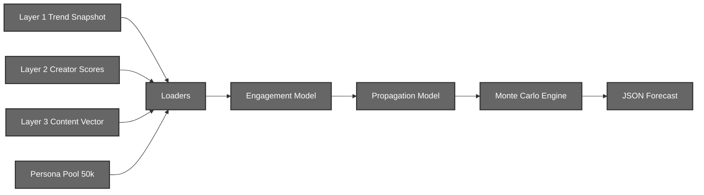
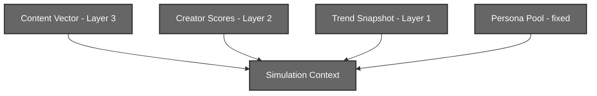
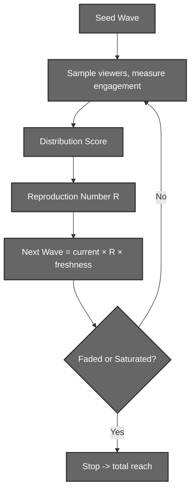
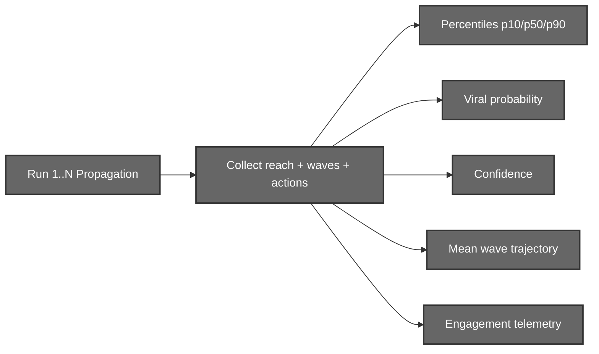
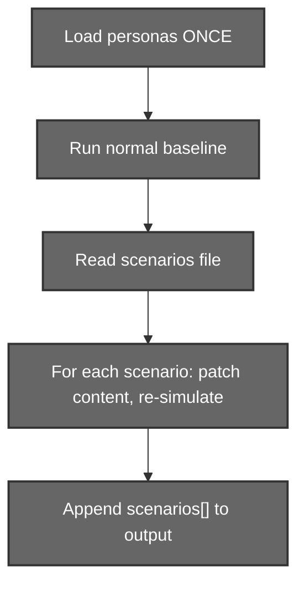

# Simulator (Layer 4)

## Agent-Based Virality Simulation System

# 1. Introduction

The Simulator is an agent-based system that predicts how a piece of content will spread on a modern recommendation-driven platform.

Unlike a formula that outputs a single "virality score", the simulator **replays the post thousands of times** across a population of 50,000 synthetic viewers. Each replay introduces realistic randomness, and the aggregate of all replays produces a **range of outcomes** rather than a single guess.

The simulator is a standalone C++ program. It reads JSON produced by the upstream layers, runs the simulation, and prints a JSON forecast. It never talks to the other layers directly, Python invokes it as a subprocess.

The forecast answers three questions:

```text
How many people will realistically see this post?
How likely is it to break out (go viral)?
How confident is that prediction?
```

---

# 2. Simulation Motivation

## Why Not a Single Formula?

A single formula produces a single number.

```text
Content + Creator
        ↓
    Score = 72
```

But the feed is not deterministic. The same post, from the same creator, can land quietly one day and explode the next, the difference is luck: which early viewers happen to see it, and whether they happen to react.

A single score cannot express this.

## Why Agent-Based Simulation?

Instead of scoring the post, we **simulate the audience reacting to it**.

```text
Post shown to a wave of viewers
        ↓
Each viewer independently decides to watch / like / share / save
        ↓
Their reactions decide whether the algorithm promotes it to a bigger wave
        ↓
Repeat until the post fades or saturates the audience
```

Because every viewer's decision is probabilistic, one full run is one possible "life" of the post.

## Why Monte Carlo?

Running the simulation once gives one outcome. Running it thousands of times and collecting the results gives a **distribution**.

```text
Run 1  →  40,000 reach
Run 2  →  12,000 reach
Run 3  →  310,000 reach   (a lucky breakout)
...
Run 5000 → 55,000 reach
```

From this distribution we read the expected reach, the quiet-day and breakout percentiles, and the fraction of runs that went viral. One lucky roll can no longer fool the forecast.

---

# 3. System Architecture



The simulator has four inputs and one output.

- **Engagement Model** decides how a single viewer reacts to the content.
- **Propagation Model** decides how one full run of the post spreads across waves.
- **Monte Carlo Engine** runs the propagation many times and aggregates the results.

---

# 4. Technology Stack

| Component        | Technology              | Purpose                                  |
| ---------------- | ----------------------- | ---------------------------------------- |
| Core Engine      | C++17                   | Fast per-agent simulation                |
| JSON Parsing     | nlohmann/json (vendored)| Reading inputs, writing the forecast     |
| Randomness       | `std::mt19937`          | Seeded, reproducible Monte Carlo         |
| Invocation       | Python `subprocess`     | Called by the backend `/analyse` route   |

Build command:

```text
g++ -std=c++17 -O2 -Wall -Wextra -Iinclude src/*.cpp -static -o simulator.exe
```
---

# 5. Simulation Inputs

The simulator consumes four inputs, each produced by a different layer.



## 5.1 Content Vector

Produced by the Context Engine (Layer 3). Describes what the post *is*.

```python
{
    "dims": {                 # 8 engagement dimensions, 0-10
        "humor": float, "curiosity": float, "educational": float, "novelty": float,
        "controversy": float, "emotional_intensity": float,
        "relatability": float, "practical_value": float
    },
    "composites": {
        "shareability": float,   # 0-10
        "saveability": float     # 0-10
    },
    "topics": { "<topic>": 0.0 or 1.0 },   # 24-topic taxonomy, binary presence
    "entities": [str],                     # named subjects (people, events, brands)
    "tags": [str]                          # creator hashtags
}
```

## 5.2 Creator Scores

Produced by the User Engine (Layer 2). Describes *who is posting*.

| Field                 | Range | Meaning                                  |
| --------------------- | ----- | ---------------------------------------- |
| creator_trust_score   | 0-100 | Algorithmic credibility                  |
| creator_momentum_score| 0-100 | Recent growth / activity                 |
| niche_authority_score | 0-100 | Reach efficiency within the niche        |
| audience_quality_score| 0-100 | Genuineness of the audience              |
| creator_volatility_score | 0-100 | Post-to-post performance instability  |

The raw metrics block (followers, monthly reach, posting frequency) is also read to size the starting audience.

## 5.3 Trend Snapshot

Produced by the Trend Engine (Layer 1). Describes *what is trending right now*.

```python
{
    "topic_trends":      { "<topic>": float },        # 24-vec, per-topic heat
    "trending_entities": [ {"label": str, "weight": float} ],
    "tag_trends":        { "<tag>": float }
}
```

Missing trend snapshot degrades gracefully to a neutral (no-trend) baseline.

## 5.4 Persona Pool

A fixed population of 50,000 synthetic viewers. Described in the next section.

---

# 6. The Persona Pool

The pool is the audience. Every run shows the post to viewers sampled from this population.

## 6.1 Persona Schema

Each of the 50,000 agents carries ~19 attributes.

```python
{
    "id": str,
    "demographics": { "age": int, "age_band": str, "sex": str, "region": str },

    "affinities": {           # 8 SIGNED affinities, -1..1 (allow repulsion)
        "<dimension>": float  # one per Layer-3 dimension
    },

    "propensities": {         # 6 action tendencies, 0..1
        "retention": float, "like": float, "comment": float,
        "share": float, "save": float, "follow": float
    },

    "trend_susceptibility": float,   # 0..1, how much trends pull this viewer
    "activity": float,               # 0..1, how active on the platform

    "interests": { "<topic>": float } # weights over the 24-topic taxonomy
}
```

## 6.2 Design Intent

The persona model reflects an **algorithm-driven feed** (TikTok / Reels / Shorts), not a social graph.

- Viewers have **no follower/friend attribute**, the algorithm, not the network, decides who sees the post.
- **Affinities are signed**, a viewer can be actively *repelled* by a dimension (e.g. dislikes controversy), not just neutral.
- Creator scores are treated as **simulation mechanics** (seed size, algorithmic favorability, variance), never as viewer attributes.

## 6.3 How the Pool Was Built


The source dataset is **[NVIDIA Nemotron-Personas-USA](https://huggingface.co/datasets/nvidia/Nemotron-Personas-USA)**, a large, census-grounded population of synthetic personas. It was mapped by an LLM (**Gemini Flash**) into the SimPersona schema, then **calibrated programmatically** because a general-population dataset is not a content-viewer dataset. Calibration corrects three biases:

1. **Propensity inflation**, real audiences save/follow rarely, so these are right-skewed to a minority behavior.
2. **Affinity positivity**, several dimensions came out ~100% positive; they are rank-spread into ranges that *include repulsion*.
3. **Interest over-assignment**, interests are pruned to the 3-5 genuine ones per viewer.

Four traits are **age-driven** (young viewers scroll fast, chase trends, like erratically; older viewers like consistently, chase trends less). The pool skews young (~72% under 35) to mirror a real short-form audience.

---

# 7. Engagement Model

The Engagement Model answers one question: **given this viewer and this content, how does the viewer react?**

## 7.1 Two-Factor Principle

Every action is the product of a *tendency* and an *appeal*.

```text
P(action) = viewer.propensity × f(content appeal)
```

A viewer who rarely shares will still rarely share great content; a viewer who loves to share still won't share content that does not appeal to them.

## 7.2 The Pull (Appeal Gate)

Appeal is a **quality** term modulated by a **gate**.

```text
pull = quality × gate
```

`quality` is the average of the 8 content dimensions.

The `gate` is where the viewer's personal fit enters:

```text
gate =  0.25  (base)
      + 0.45 × interest_match          (topics ↔ viewer interests)
      + 0.40 × positive_affinity_match (dims ↔ viewer likes)
      + 0.50 × negative_affinity_match (dims ↔ viewer dislikes → repulsion)
      + 0.25 × trend_alignment × trend_susceptibility
```

**Interest match** weights the content's topics against the viewer's interests:

```text
interest = Σ (viewer.interest[t] × content.topic[t])
           ────────────────────────────────────────
                     Σ content.topic[t]
```

**Affinity match** weights the content's dimensions against the viewer's signed affinities:

```text
affinity = Σ (viewer.affinity[d] × content.dim[d])
           ─────────────────────────────────────
                     Σ content.dim[d]
```

A negative affinity match subtracts pull, the viewer is repelled.

## 7.3 Action Levers

Once pulled in, individual actions are driven by different content signals:

| Action  | Driven by                                          |
| ------- | -------------------------------------------------- |
| watch   | pull (retention)                                   |
| like    | pull                                               |
| comment | controversy + emotional intensity ("provoke")      |
| share   | shareability                                       |
| save    | saveability + useful dimensions (educational, practical) |
| follow  | pull                                               |

This is why divisive content produces disproportionately many comments, and how-to content produces disproportionately many saves.

---

# 8. Trend Alignment

Trend alignment measures how well the content matches what is trending. It is computed once per run and feeds the engagement gate.

Three channels are combined:

```text
trend_alignment =  0.60 × topic_match
                 + 0.25 × entity_match
                 + 0.15 × tag_match
```

| Channel | Match method                                                         |
| ------- | -------------------------------------------------------------------- |
| topic   | Dot product of the content's 24-topic vector with `topic_trends`     |
| entity  | Jaccard token similarity of content entities vs `trending_entities`  |
| tag     | Jaccard token similarity of content tags vs `tag_trends` keys        |

Entity and tag matching cannot be exact, a free-form name ("World Cup final") must still match a resolved label ("FIFA World Cup"). Each string is lowercased and split into a set of word tokens (**A** and **B**), then scored with **Jaccard similarity**:

```text
              | A ∩ B |
J(A, B)  =  ───────────────
              | A ∪ B |
```

A content entity (or tag) counts as a match to a trending label when **J ≥ 0.5**, or when one token sequence is contained in the other. The matched trend's weight is added to that channel (the entity and tag channels are each capped at 1.0).

---

# 9. Propagation Model

The Propagation Model simulates **one full life of the post**: a sequence of waves, each larger and broader than the last, that continues only while each wave keeps reacting well.

## 9.1 Wave Loop



At most 14 waves run per life.

## 9.2 Seed Size

The first wave is sized from the creator's demonstrated reach, not their raw follower count.

```text
raw = SEED_BASE
    + SEED_RPP × √(reach_per_post)
    + SEED_FLW × √(followers) × audience_quality_factor
    + SEED_MOM × (momentum / 100)
```

with `SEED_BASE=300`, `SEED_RPP=40`, `SEED_FLW=5`, `SEED_MOM=200`.

The raw seed is then **soft-capped** to at most 10% of the audience pool, so a mega-creator cannot saturate everyone on the first wave:

```text
seed_size = cap × tanh(raw / cap),   cap = 0.10 × pool
```

Keying the seed to reach-per-post rather than followers means **bought followers are punished**, an inflated account with weak per-post reach seeds small.

## 9.3 Distribution Score → Reproduction Number

Each wave, a sample of viewers reacts. Their reactions form a **distribution score** (a weighted blend of watch/like/comment/share/save):

```text
W_WATCH 0.35 + W_SHARE 0.25 + W_LIKE 0.15 + W_COMMENT 0.15 + W_SAVE 0.10
```

The distribution score is converted into a reproduction number `R`, how much the next wave grows:

```text
next_wave = current_wave × R × freshness
R = R_GAIN × distribution_score × ...        (R_GAIN = 4.5)
```

**Freshness** decays the post's momentum over time (`FLOOR = 0.86`), and **beta** (audience targeting) starts tight (`BETA0 = 5.0`) and broadens each wave (`× 0.5`) toward the general population, modelling the algorithm expanding from the core audience outward.

## 9.4 Per-Run Luck

Each run is multiplied by a **mean-one lognormal** luck factor:

```text
luck ~ LogNormal,   E[luck] = 1,   σ = 0.30 + 0.25 × (1 − consistency)
```

Because it is **mean-one**, volatility widens the spread of outcomes *without* inflating the average. Without per-run luck, outcomes were binary (strong content always viral, weak content never), luck is what makes a nano-creator's lottery win possible but rare.

## 9.5 Termination

A run stops when the post fades (waves shrink toward zero) or saturates the addressable audience. A post is counted **viral** when its total reach exceeds `viral_threshold` (30%) of the pool.

---

# 10. Monte Carlo Engine

The Monte Carlo Engine runs the propagation `N` times (default 5,000) with a fixed base seed, then aggregates.



## 10.1 Reach Distribution

The reach of all `N` runs is sorted to read percentiles:

```text
reach_p10  →  a quiet day
reach_p50  →  a typical run
reach_p90  →  if it pops
expected_reach → the mean across all runs
```

## 10.2 Viral Probability

```text
viral_probability = (runs where reach > 30% of pool) / N
```

## 10.3 Confidence

Confidence blends a floor, the creator's data history, and the tightness of the outcome distribution:

```text
spread     = (reach_p90 − reach_p10) / reach_p50
confidence = C_FLOOR + C_DATA × data_confidence + C_TIGHT / (1 + 0.5 × spread)
```

A tighter, better-supported distribution yields higher confidence.

> Confidence is a **reliability heuristic**, not a calibrated P(correct). The key name is preserved for the frontend contract; true calibration awaits real outcome data.

## 10.4 Wave Trajectory and Telemetry

The engine also emits the **mean wave trajectory** (and per-wave p10/p50/p90) plus **engagement telemetry**, expected likes, comments, shares, saves and follows per run, mapped from action intent to observed rates via observation scales (likes ≈ 8%, comments ≈ 1% per viewer, etc.).

## 10.5 Determinism

For a fixed seed the entire forecast is **byte-identical** across runs. This is what makes the counterfactual re-simulation in Layer 5 a clean paired comparison.

---

# 11. Output Schema

The simulator prints one JSON object to standard output.

```python
{
    "content_id":        str,
    "runs":              int,
    "audience_pool":     int,     # 50000
    "trend_alignment":   float,   # 0-1

    "expected_reach":    float,
    "reach_p10":         float,
    "reach_p50":         float,
    "reach_p90":         float,
    "viral_probability": float,   # 0-1
    "confidence":        float,   # 0-1

    "mean_wave":         [float], # mean reach per wave
    "wave_p10":          [float],
    "wave_p50":          [float],
    "wave_p90":          [float],

    "engagement": {               # expected actions per run
        "likes": float, "comments": float, "shares": float,
        "saves": float, "follows": float
    }
}
```

Standard error carries progress logs (persona load time, trend alignment, run timing).

---

# 12. Command-Line Interface

The simulator is name-based, the backend passes resolved names or paths.

```text
simulator.exe --content <name> [--creator <name>]
              [--runs N] [--seed S] [--data DIR] [--pretty] [--scenarios FILE]
```

| Flag         | Meaning                                                          |
| ------------ | ---------------------------------------------------------------- |
| --content    | username, content file name, or path (required)                  |
| --creator    | user id, creator file name, or path (optional; neutral if absent)|
| --runs       | Monte Carlo iterations (default 5000)                            |
| --seed       | random seed (default 42) → reproducible forecast                 |
| --data       | data directory root (content / creators / trends)               |
| --pretty     | pretty-print the JSON                                            |
| --scenarios  | counterfactual scenario file (see Section 13)                   |

Name resolution:

```text
content:  path → data/content/<name> → newest in data/content/<user>/ → filename in any user
creator:  path → data/creators/<name> → newest ...-<id>-creator.json
```

Unresolvable names fail loudly; a missing creator or trend degrades to neutral defaults.

---

# 13. Counterfactual Scenario Mode

Layer 5 needs to know *what would happen if the creator changed one thing about the post*. To answer this efficiently, the simulator has an **additive scenario mode**.



With `--scenarios FILE`, the exe loads the 50k personas once, runs the normal baseline, then applies a list of patch "ops" to copies of the content and re-simulates each, all in the same process.

Scenario file:

```python
{
    "runs": 1000,               # fewer runs; only scalar deltas are needed
    "scenarios": [
        { "label": "__control__", "ops": [] },
        { "label": "dim:humor",   "ops": [{"dim": "humor", "delta": 2.0}] },
        ...
    ]
}
```

Supported ops:

```text
{"dim": <name>, "delta": D}                     adjust a dimension (clamped 0-10)
{"composite": "shareability|saveability", "delta": D}
{"topic": <name>, "set": V}                     set a topic value
{"add_entity": <label>}                         add an entity (deduped)
{"add_tag": <tag>}                              add a tag (deduped)
```

Each scenario is re-simulated with the **same seed** as the control, so the difference in reach is a clean paired comparison, not two noisy estimates. The output gains a `scenarios` array:

```python
"scenarios": [
    { "label": str, "expected_reach": float, "viral_probability": float,
      "reach_p50": float, "reach_p90": float, "trend_alignment": float }
]
```

> This mode is **purely additive**. When `--scenarios` is absent, the output is byte-identical to before, and no tuning constant is touched. See the **Layer 5 (Analyse Engine)** documentation for how these deltas become suggestions.

---

# 14. Calibration and Validation

## 14.1 Behavioral Calibration

The model was calibrated against a suite of platform-realism scenarios asserting what a real feed would do:

```text
nano creator  → mostly 0% viral, small floor reach
mid creator   → strong content ~60% viral, weak content ~0%
big creator   → floor reach even on weak content, but no guaranteed virality
on-trend      → ~+10 points of viral probability at equal quality
quality       → beats trend (great off-trend > average on-trend)
divisive      → similar reach to likable, but ~1.5× the comments per viewer
```

## 14.2 Holdout Evaluation

### How the test set was built

There is no public dataset of "social post → real reach", so the holdout was **synthetically generated**. An LLM was prompted to write **100 realistic scenarios**, each a full content vector + creator profile + trend context, modelled on how virality has historically played out: strong creators with sharp content that broke out, nano creators that stayed flat, decent posts that simply got unlucky, rage-bait that spiked comments, and deliberate **survivorship traps** (a viral-looking post that was realistically a one-in-a-thousand lottery win). Each scenario carries a binary label, **did it go viral or not**, reflecting the historic outcome the LLM was mimicking.

The simulator then ran every scenario, and its predicted viral probability was scored against that label.

### Results

| Metric                   | Result |
| ------------------------ | ------ |
| ROC-AUC                  | 0.935  |
| Best-threshold accuracy  | 88%    |
| Brier score              | 0.199  |

### What the metrics mean

- **ROC-AUC: 0.935** (*ranking quality*). Take one viral post and one non-viral post at random; the AUC is the probability the model gives the viral one the **higher** score. 1.0 is perfect separation, 0.5 is a coin flip. 0.935 means the model orders such a pair correctly ~94% of the time. It reliably separates winners from losers no matter where you draw the cut-off line.
- **Best-threshold accuracy: 88%.** At the single probability cut-off that best splits the set, 88 of the 100 scenarios are classified correctly (viral vs not).
- **Brier score: 0.199** (*calibration; lower is better*). The mean squared error between the predicted probability and the actual 0/1 outcome: `mean((p − outcome)²)`. It rewards being correct **and** appropriately confident: saying "80%" on a post that flops is punished more than saying "55%". 0 is perfect; predicting 0.5 for everything scores 0.25, so 0.199 is meaningfully better than chance.

Calibration reads systematically **conservative**, attributable to label survivorship (the labelled winners are history's successes, not randomly sampled outcomes) and a strict viral bar. The worst mispredictions were exactly the lottery / survivorship traps, which is the correct probabilistic behavior.

## 14.3 Sensitivity

The two highest-leverage constants (elasticity > 1) are `R_GAIN` and the freshness `FLOOR`, the first targets for calibration once real per-post outcome data exists.

---

# 15. Conclusion

The Social Ecosystem Simulator turns a static content vector into a **distribution of possible futures**. By simulating individual viewers reacting to the post, letting the algorithm promote it through widening waves, and repeating the whole life thousands of times, it produces not a single virality score but a full forecast: expected reach, an outcome range, a viral probability, and a confidence.

Its determinism per seed makes it more than a predictor: it is a **controlled experiment engine**, which Layer 5 uses to measure exactly how much a single edit would change the post's fate.
