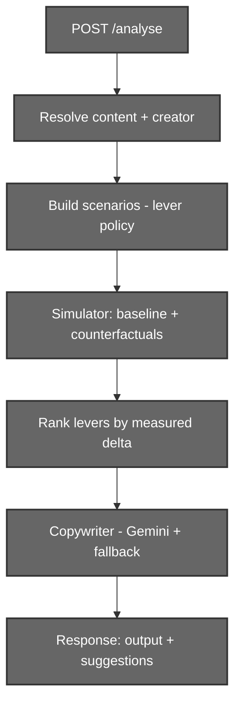
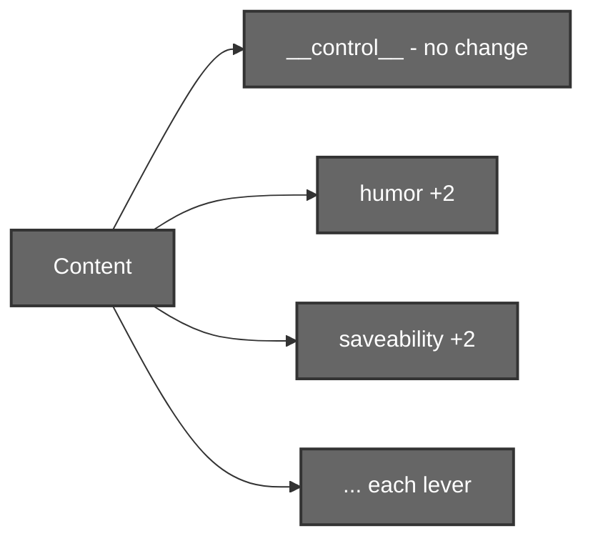
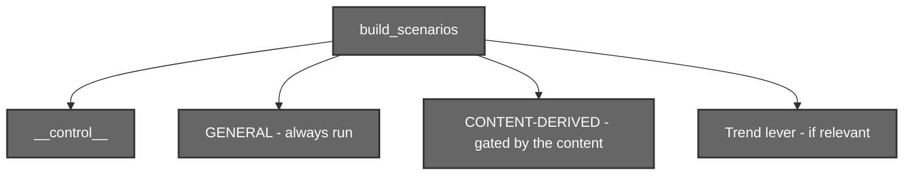
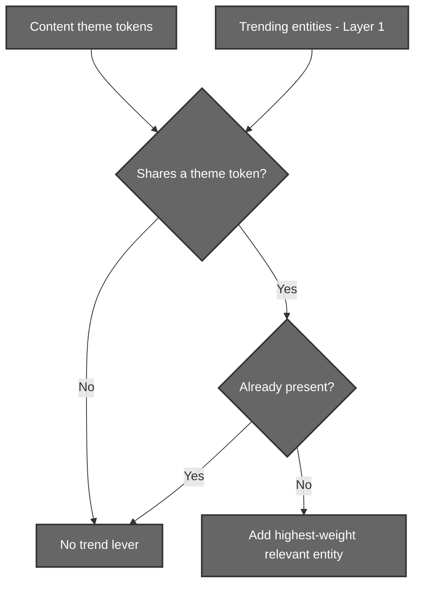
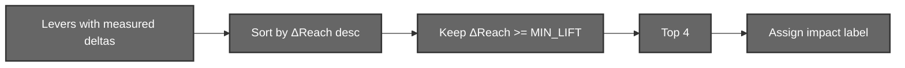

# Analyse Engine (Layer 5)

## Insight & Optimization System

# 1. Introduction

The Analyse Engine is the final layer of the pipeline. It turns the Layer 4 forecast into a **verdict and a set of ranked, actionable suggestions** for the creator, the "edit desk" that tells them what to change *before* they post.

The engine is deliberately **hybrid**:

```text
The simulator decides WHICH edits help and BY HOW MUCH   (measured, deterministic)
Gemini decides HOW to say it                             (natural language)
```

It never guesses whether an edit would help. To find out, it **actually re-runs the simulation** with that edit applied and measures the difference. The numbers are real; only the prose is generated.

The engine lives in the `Analyser/` Python package and is exposed through a single backend route, `POST /analyse`.

---

# 2. Motivation

## Why Not Just Rank the Dimensions?

The naive approach reads the content's scores and tells the creator to improve the weakest one.

```text
saveability = 3  →  "improve saveability"
```

But this ignores the mechanics of spread. A low score is not the same as a high-leverage lever, raising saveability on a meme barely moves reach, while sharpening a strong hook can widen the whole outcome range.

## Why Re-Simulate?

To know how much an edit actually helps, we **do the experiment**.

```text
Take the exact post
        ↓
Nudge ONE thing (e.g. humor +2)
        ↓
Re-run the full simulation
        ↓
Measure the change in expected reach vs the unchanged post
```

The change in reach *is* the lever's impact. This is real scenario testing, not a heuristic.

## Why Hybrid?

The measured deltas are trustworthy but not readable. Gemini converts them, grounded in the content's own specifics, into advice a creator can act on, while every number it cites comes from the simulation.

---

# 3. System Architecture



The engine issues **one** simulator invocation that returns both the headline baseline (the forecast) and every counterfactual (the levers), then ranks and phrases the result.

---

# 4. Technology Stack

| Component        | Technology                | Purpose                                   |
| ---------------- | ------------------------- | ----------------------------------------- |
| Orchestration    | Python                    | Build scenarios, rank, assemble response  |
| API              | FastAPI (`/analyse`)      | Endpoint consumed by the frontend         |
| Simulation       | Layer 4 `simulator.exe`   | Baseline + counterfactual re-runs         |
| Copywriting      | Gemini `gemini-2.5-flash` | Turns measured deltas into prose          |
| Fallback         | Rule-based templates      | Deterministic copy if Gemini is down      |

Module layout:

```text
Analyser/
    __init__.py     exposes analyze(), SimError
    levers.py       lever policy + ranking
    copywriter.py   Gemini prose + templated fallback
    engine.py       orchestrator
```

---

# 5. The Lever Concept

A **lever** is one thing about the post a creator can actually change, tested by re-simulation.

Each lever is a **content patch** plus a direction:

```text
humor +2            "make it funnier"
saveability +2      "add a save-worthy takeaway"
controversy −2      "tone down the divisiveness"
add trending entity "ride a trend you're relevant to"
```

Every lever maps to a scenario the simulator can run:

```python
{ "label": "dim:humor", "ops": [{"dim": "humor", "delta": 2.0}] }
```

Crucially, every lever is something a creator can *act on*, never a model constant they cannot touch.

---

# 6. Counterfactual Re-Simulation

## 6.1 The Control

The scenario list always begins with a `__control__`, the **unchanged** content, re-run at the same lower run-count as the variants.



The control is the reference point. Every lever's impact is measured **against the control**, not against the headline forecast.

## 6.2 Paired Comparison

The control and every variant are simulated with the **same seed**. Because the simulator is deterministic per seed, the only difference between the control run and a variant run is the single content change, so the delta is a clean paired measurement, and Monte-Carlo noise cancels out.

```text
ΔReach%  =  (variant.expected_reach − control.expected_reach)
            ───────────────────────────────────────────────  × 100
                        control.expected_reach
```

## 6.3 Two Baselines

There are two simulations of the unchanged post, for two purposes:

| Simulation      | Runs | Purpose                                   |
| --------------- | ---- | ----------------------------------------- |
| Headline baseline | 5000 | The forecast shown to the creator       |
| `__control__`     | 1000 | The reference for measuring lever deltas |

The lower run-count for counterfactuals is safe because the paired seed keeps the ranking stable, verified identical down to 1,000 runs.

---

# 7. Lever Policy

Not every edit is appropriate for every post. Telling a hard-news creator to "add more humor" is tone-deaf, even if the simulator measures a reach gain because the simulator answers *"would it spread?"*, not *"is it appropriate?"*. **Judging appropriateness is the Analyse Engine's job.**

Levers are therefore split into two arrays.



## 7.1 General Levers (always run)

Craft that improves any post without clashing with its genre:

```text
curiosity, novelty, relatability, emotional_intensity, shareability
```

## 7.2 Content-Derived Levers (gated)

Genre-sensitive edits, emitted **only when the content already has that quality**, we amplify a strength, never inject an alien one.

| Lever             | Condition to emit                          |
| ----------------- | ------------------------------------------ |
| humor             | current humor ≥ BOOST_GATE                  |
| educational       | current educational ≥ BOOST_GATE            |
| practical_value   | current practical_value ≥ BOOST_GATE        |
| controversy_up    | current controversy ≥ BOOST_GATE            |
| controversy_down  | current controversy ≥ CONTROVERSY_DOWN_GATE |
| saveability       | current saveability ≥ BOOST_GATE            |

with `BOOST_GATE = 3.5` and `CONTROVERSY_DOWN_GATE = 5.0`.

## 7.3 Why the Gate Works

The content's own dimension profile already encodes its genre.

```text
Comedy meme:  humor 8, educational 0, practical 0   → humor kept, utility dropped
Hard news:    humor 1, curiosity 8                  → humor dropped
```

No topic-to-dimension mapping is needed, the profile speaks for itself.

Example (a real comedy meme):

```text
Without the gate:  "make your meme more divisive"   (controversy +4.9%)
                   "add educational value"          (educational +3.5%)
With the gate:     controversy / educational never generated
                   suggestions: emotional, humor, relatability, curiosity
```

---

# 8. The Trend Lever

The trend lever suggests aligning with a currently trending entity, but only when that entity is relevant to the content.



The relevance filter (token overlap between the content's topics / entities / tags and the entity's label / tags) is essential: the trend snapshot's highest-weight entity is often resolver noise, and without the filter the simulator would reward adding it (any entity match raises alignment → reach) and surface nonsense advice.

---

# 9. Ranking and Selection

Once the simulator returns the counterfactual deltas, the levers are ranked and filtered.



## 9.1 Filter and Rank

Levers are sorted by ΔReach against the control. Only those clearing MIN_LIFT_PCT (1.5%) survive, and at most the top 4 are surfaced. Levers that do not help are dropped automatically. For instance, a post already aligned with current trends yields a ~0% trend lever and is therefore discarded.

## 9.2 Impact Label

The impact label is derived from the measured delta in Python, never by the language model.

```text
ΔReach ≥ 15%   →  high
ΔReach ≥ 5%    →  medium
otherwise      →  low
```

## 9.3 The p90 Tail Signal

Alongside expected reach, each lever carries a p90 delta, which measures how much it raises the "if it pops" ceiling.

This distinguishes two different kinds of help:

```text
Strong / saturated content:  reach lifts, but p90 pinned at ceiling  → raises the typical run
Weak / uncapped content:     p90 moves with the lever                → raises the ceiling
```

The tail signal is only exposed to the copywriter when it clears P90_TAIL_MIN_PCT (4.0%), above the paired run noise floor, so a "widens the upside tail" claim can never fire on noise.

---

# 10. The Copywriter

The copywriter turns each ranked lever into a `{title, detail, impact}` suggestion.

## 10.1 What Gemini Receives

For each lever, a compact brief:

```python
{
    "subject": "humor",
    "current_score": "8.0/10",
    "suggested_action": "land a harder punchline or funnier framing",
    "sim_reach_lift_pct": 6.1,
    "sim_viral_lift_points": 3.7,
    "sim_p90_lift_pct": 9.4,          # only when it clears the gate
    "why_it_scored": "the bizarre dream elements are highly amusing...",
    "impact": "medium"
}
```

## 10.2 Content Grounding

`why_it_scored` is **Layer 3's stored per-dimension reasoning**, the analysis that was previously saved and never used. It describes the actual post ("the surreal dream-logic"), letting Gemini write grounded advice instead of a template.

```text
Generic:   "Land a harder punchline."
Grounded:  "While the bizarre dream is already amusing, a harder punchline could
            lift simulated reach ~6%."
```

## 10.3 Anti-Hallucination Guardrails

The prompt enforces strict discipline:

- Cite **only** the metrics provided for a lever (`sim_reach_lift_pct`, `sim_viral_lift_points`, and `sim_p90_lift_pct` when present) never invent p10/p50/confidence or percentile claims.
- `why_it_scored` describes the **current** post; it is not evidence the edit will work. The edit is a **recommendation**, not something already present.
- Frame lifts as **simulated estimates**, not promises.
- Only the top lever may be called "the strongest".

## 10.4 Deterministic Fallback

If Gemini is unavailable, the copywriter falls back to rule-based templates keyed off the same measured deltas. The endpoint therefore always returns useful suggestions, and the impact labels / ranking remain identical either way.

---

# 11. Output Schema

The engine returns the exact shape the frontend expects.

```python
{
    "output": {                     # the 7-field forecast (from Layer 4)
        "expected_reach": float,
        "reach_p10": float, "reach_p50": float, "reach_p90": float,
        "viral_probability": float,
        "confidence": float,
        "mean_wave": [float]
    },
    "suggestions": [
        { "title": str, "detail": str, "impact": "high" | "medium" | "low" }
    ],

    "content_id": str,              # extra context, available for future use
    "audience_pool": int,
    "trend_alignment": float,
    "engagement": { "likes": float, "comments": float, ... }
}
```

`output` feeds the forecast panel; `suggestions` feed the edit desk.

---

# 12. API

```text
POST /analyse
    ?content_id=<id>     content analyzed via /context/analyze  (required)
    &user_id=<id>        creator analyzed via /user/creator/analyze  (required)
    &runs=5000           baseline Monte Carlo runs
    &scenario_runs=1000  runs per counterfactual
    &seed=42             reproducible forecast + paired counterfactuals
```

Both ids are required, the product flow always authorizes the creator before simulating.

Resolution and errors mirror the Layer 4 `/simulate` route:

| Situation             | Response |
| --------------------- | -------- |
| content/creator not found | 404  |
| simulator failure         | 500  |
| timeout (120s)            | 504  |
| exe not built             | 503  |

The route is intentionally **separate** from `/simulate`, which remains a pure Layer-4 passthrough.

---


# 13. Conclusion

The Analyse Engine closes the loop of the pipeline. Where Layer 4 forecasts a post's fate, Layer 5 asks **what would change that fate** and answers by running controlled experiments on the post itself, one lever at a time.

By measuring impact through real re-simulation, curating which edits are appropriate to the content's genre, and grounding the final advice in the post's own specifics, it delivers suggestions that are simultaneously **data-driven, tasteful, and specific**, the difference between "improve saveability" and "your humor works off the surreal dream-logic; push that absurdity harder."
